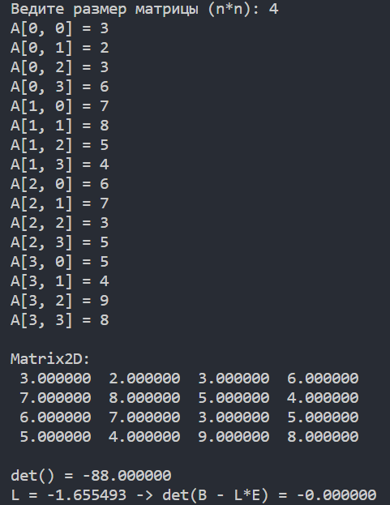

# Matrix

## О программе

*Программа решает две задачи:*

1. *Вычисление опредилителя квадратной матрицы $(n*n)$ методом элементарных преобразований с выбором главного элемента.* 
2. *Найти какое-нибудь собственное значение L матрицы B, т.е. корень уравнения $det(B-L*E)=0$ с точностью 10^(-12) методом вилки.*

## Как запустить (linux)

*Для запуска программы небходимо:*

1. `make`
2. `./main matrix/A.txt`
3. *Вывод →*

На рисунке видна матрица файла `matrix/A.txt` . Посчитана определитель этой матрицы и  найдена *собственное значение.*

*Можно написать собственную матрицу, тогда необходимо:*

1. `make`
2. `./main`
3. *Вывод →*

Водим размер матрицы, после чего заполняем ее. Видим саму матрицу, а также ее посчитанный определитель и собственное значение.